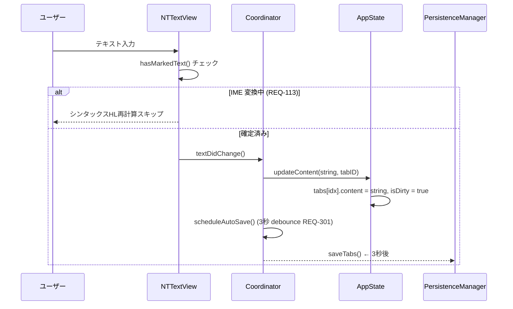
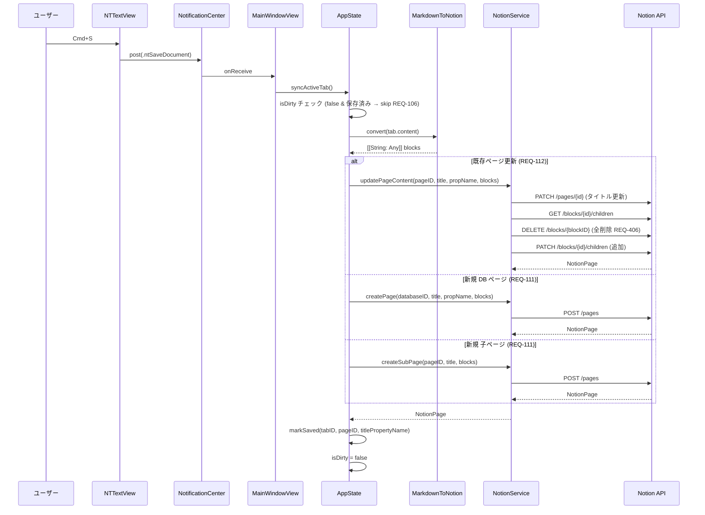
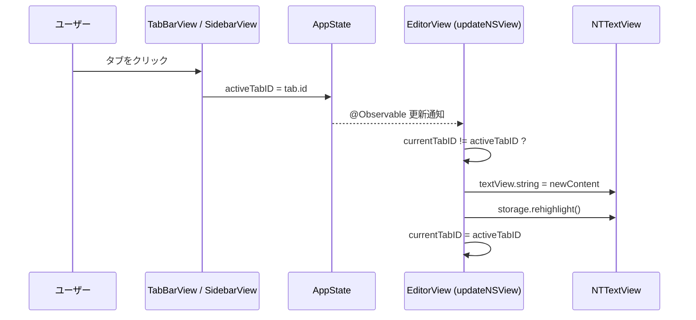
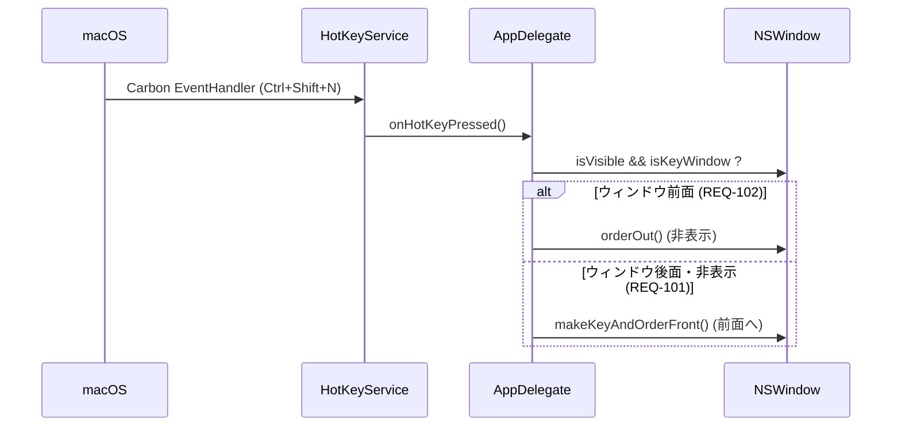
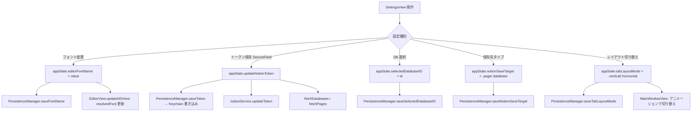
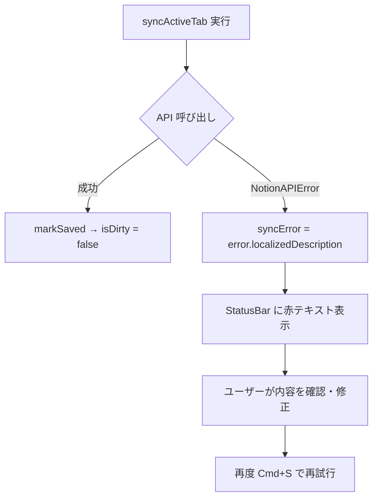
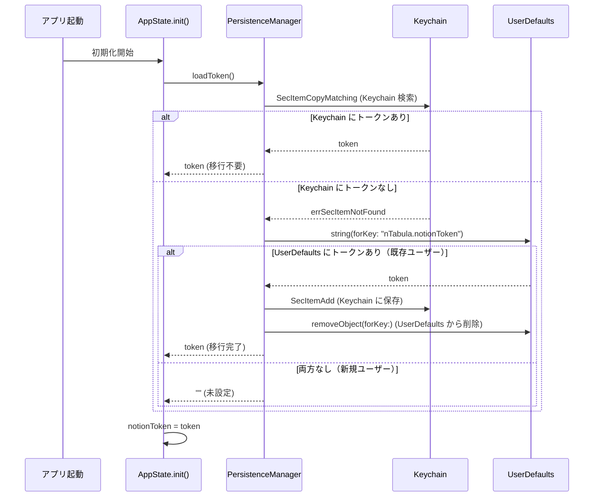
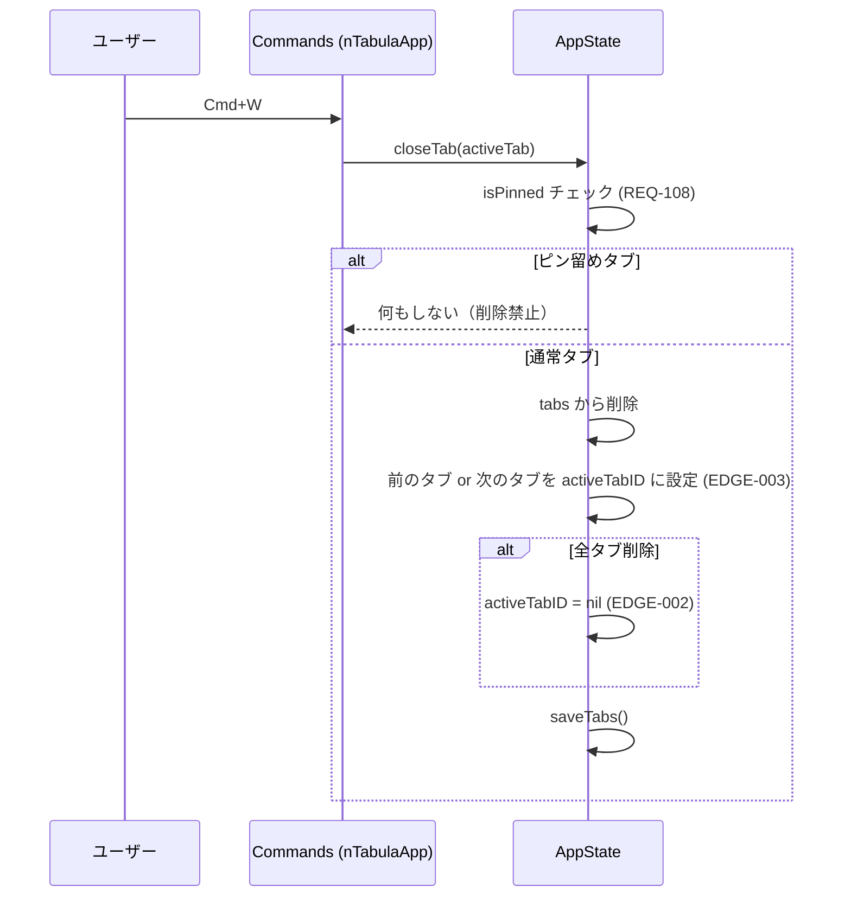
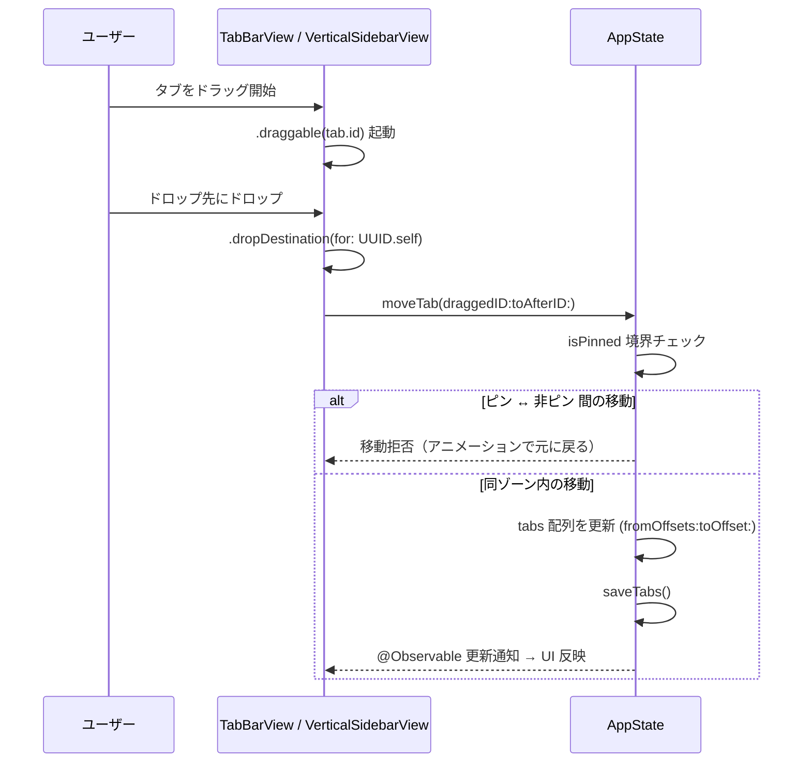
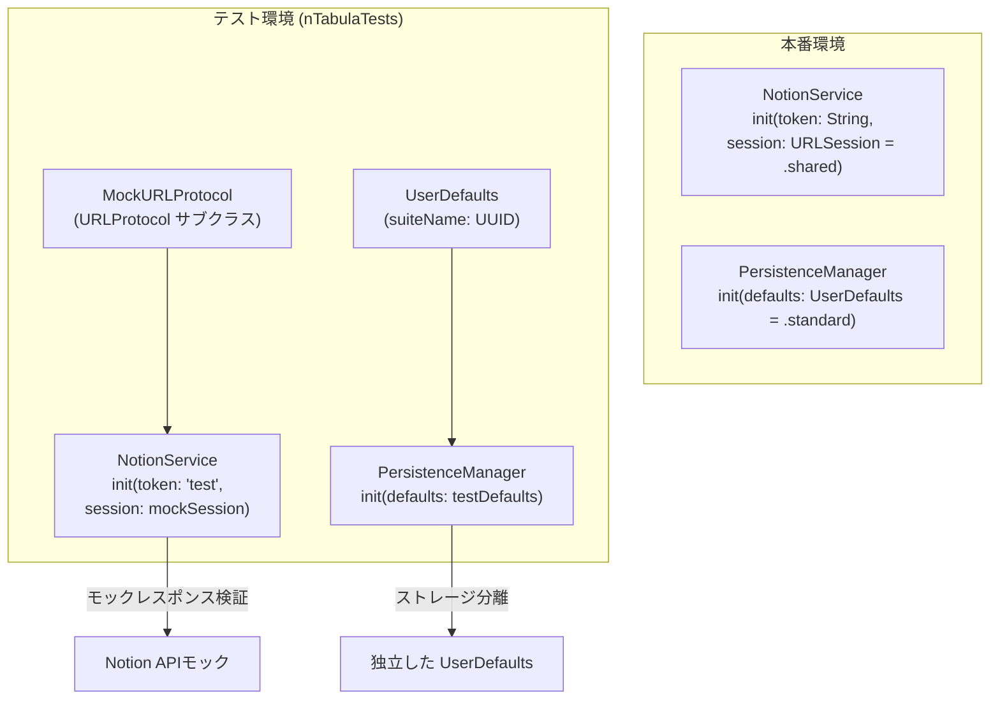

# nTabula データフロー図

**作成日**: 2026-03-16
**更新日**: 2026-03-16（kairo-design によるヒアリング反映）
**関連アーキテクチャ**: [architecture.md](architecture.md)
**関連要件定義**: [requirements.md](../../spec/ntabula/requirements.md)

**【信頼性レベル凡例】**:
- 🔵 **青信号**: EARS要件定義書・設計文書・ユーザヒアリングを参考にした確実なフロー
- 🟡 **黄信号**: EARS要件定義書・設計文書・ユーザヒアリングから妥当な推測によるフロー
- 🔴 **赤信号**: EARS要件定義書・設計文書・ユーザヒアリングにない推測によるフロー

---

## 1. テキスト入力フロー 🔵

**信頼性**: 🔵 *EditorView.swift Coordinator・AppState.updateContent()より*

**関連要件**: REQ-003, REQ-113, REQ-301, NFR-001, NFR-002



---

## 2. Notion 保存フロー (Cmd+S) 🔵

**信頼性**: 🔵 *nTabulaApp.swift・MainWindowView.swift・AppState.syncActiveTab()より*

**関連要件**: REQ-103, REQ-106, REQ-109, REQ-110, REQ-111, REQ-112, REQ-201



---

## 3. タブ切り替えフロー 🔵

**信頼性**: 🔵 *EditorView.swift updateNSView()より*

**関連要件**: REQ-202, NFR-002



---

## 4. グローバルホットキーフロー (Ctrl+Shift+N) 🔵

**信頼性**: 🔵 *HotKeyService.swift・AppDelegate.swiftより*

**関連要件**: REQ-101, REQ-102



---

## 5. 設定変更フロー 🔵

**信頼性**: 🔵 *SettingsView.swift・AppState.updateNotionToken()より*

**関連要件**: REQ-301, REQ-302, REQ-303, REQ-403, NFR-101, NFR-103



---

## 6. 状態管理フロー 🔵

**信頼性**: 🔵 *AppState.swift・PersistenceManagerより*

**関連要件**: REQ-001, REQ-002, REQ-005

```mermaid
flowchart LR
    subgraph AppState ["AppState (@Observable)"]
        T[tabs: TabItem]
        AID[activeTabID]
        NST[notionSaveTarget]
        DB[selectedDatabaseID]
        PP[selectedParentPageID]
        UI[tabLayoutMode / fontSize etc]
    end

    subgraph Views
        MW[MainWindowView]
        EV[EditorView]
        TB[TabBarView]
        SB[VerticalSidebarView]
        ST[SettingsView]
    end

    AppState -->|@Environment 読み取り| Views
    Views -->|メソッド呼び出し| AppState
    AppState -->|PersistenceManager| UD[(UserDefaults\nタブ・設定)]
    AppState -->|PersistenceManager| KC[(Keychain\nNotionToken)]
```

---

## 7. エラーハンドリングフロー 🔵

**信頼性**: 🔵 *AppState.swift・MainWindowView.swiftより*

**関連要件**: EDGE-001, NFR-201



---

## 8. Keychain トークン移行フロー（新規） 🔵

**信頼性**: 🔵 *REQ-403・ユーザヒアリング 2026-03-16 起動時自動移行確認より*

**関連要件**: REQ-403, NFR-101



---

## 9. Cmd+W タブ閉じフロー（新規） 🔵

**信頼性**: 🔵 *REQ-105・ユーザヒアリング 2026-03-16 Cmd+W確認より*

**関連要件**: REQ-105, REQ-108, EDGE-002, EDGE-003



---

## 10. タブ D&D 並び替えフロー（新規） 🔵

**信頼性**: 🔵 *REQ-305・ユーザヒアリング 2026-03-16 D&Dアプローチ確認より*

**関連要件**: REQ-305



---

## 11. テスト注入アーキテクチャ（新規） 🔵

**信頼性**: 🔵 *NFR-301・NFR-302・ユーザヒアリング 2026-03-16 Unit Test確認より*

**関連要件**: NFR-301, NFR-302, NFR-303



---

## 信頼性レベルサマリー

- 🔵 青信号: 11件 (100%)
- 🟡 黄信号: 0件 (0%)
- 🔴 赤信号: 0件 (0%)

**品質評価**: ✅ 高品質（実装コード + ユーザヒアリングで全件確認済み）
