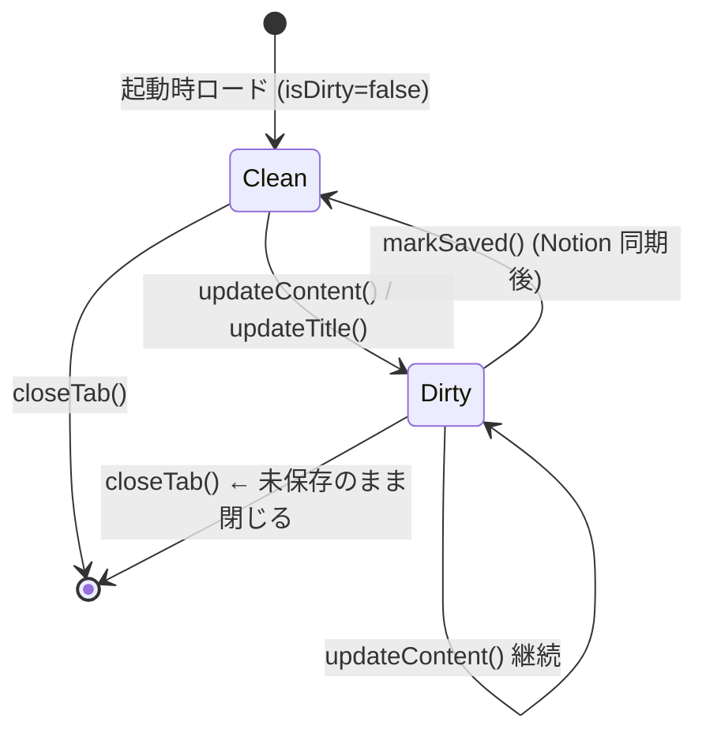

# nTabula 永続化スキーマ

**作成日**: 2026-03-16
**更新日**: 2026-03-16（kairo-design によるヒアリング反映）

> nTabula はリレーショナル DB を使用しない。タブ・設定は **UserDefaults**、Notion Integration Token は **macOS Keychain** に保存する。

---

## ストレージ分類

| データ | 保存先 | 理由 |
|-------|--------|------|
| タブ一覧 (`[TabItem]`) | UserDefaults | 機密性なし |
| 設定値（フォント・レイアウト等） | UserDefaults | 機密性なし |
| ウィンドウフレーム | UserDefaults | 機密性なし |
| Notion Integration Token | **macOS Keychain** | 🔵 機密情報 (REQ-403, NFR-101) |

---

## UserDefaults キー一覧

**信頼性**: 🔵 *PersistenceManager.swift 既存実装より*

| キー | 型 | 説明 |
|------|------|------|
| `nTabula.tabs` | Data (JSON) | `[TabItem]` 全タブをエンコード |
| `nTabula.activeTabID` | String | アクティブタブの UUID 文字列 |
| `nTabula.windowFrame` | String | `NSStringFromRect` 形式のウィンドウフレーム |
| ~~`nTabula.notionToken`~~ | ~~String~~ | ~~Notion Integration Token~~ → **Keychain に移行 (REQ-403)** |
| `nTabula.selectedDatabaseID` | String | 選択中 DB の UUID |
| `nTabula.selectedParentPageID` | String | 選択中の親ページ UUID |
| `nTabula.notionSaveTarget` | String | `"database"` \| `"page"` |
| `nTabula.tabLayoutMode` | String | `"horizontal"` \| `"vertical"` |
| `nTabula.autoSaveEnabled` | Bool | 自動保存有効フラグ（デフォルト: true） |
| `nTabula.editorFontSize` | Double | エディタフォントサイズ（デフォルト: 14、EDGE-104） |
| `nTabula.editorFontName` | String | フォントファミリー名（空文字 = SF Mono） |

---

## Keychain エントリ（新規 REQ-403）

**信頼性**: 🔵 *REQ-403・NFR-101・ユーザヒアリング 2026-03-16 Keychain確認より*

| Keychain 属性 | 値 |
|--------------|-----|
| `kSecClass` | `kSecClassGenericPassword` |
| `kSecAttrService` | `"jp.umi.design.nTabula"` |
| `kSecAttrAccount` | `"NotionToken"` |
| `kSecValueData` | Token を UTF-8 エンコードした `Data` |
| `kSecAttrSynchronizable` | 設定しない（iCloud 同期なし） |

### Keychain 操作メソッド

```swift
// 保存: Delete → Add（上書き）
SecItemDelete(query)
SecItemAdd(query, nil)

// 読み込み
SecItemCopyMatching(query, &result)

// 削除
SecItemDelete(query)
```

---

## 起動時マイグレーション（UserDefaults → Keychain）

**信頼性**: 🔵 *ユーザヒアリング 2026-03-16 起動時自動移行確認より*

```
AppState.init() での loadToken() 処理:
1. Keychain から "NotionToken" を SecItemCopyMatching で検索
2. 見つかった場合: そのまま使用（移行済み or 新規ユーザー）
3. 見つからない場合:
   a. UserDefaults["nTabula.notionToken"] を読む
   b. 空文字でなければ: Keychain に SecItemAdd → UserDefaults から removeObject
   c. 空文字の場合: "" を返す（未設定ユーザー）
```

---

## TabItem JSON スキーマ

**信頼性**: 🔵 *TabItem.swift Codable 実装より*

```json
[
  {
    "id": "uuid-string",
    "title": "2026-03-16-1",
    "content": "# 見出し\n本文テキスト",
    "notionPageID": "notion-page-uuid-or-null",
    "databaseID": "notion-db-uuid-or-null",
    "titlePropertyName": "Name",
    "isPinned": false,
    "createdAt": 1710000000.0,
    "updatedAt": 1710000000.0
  }
]
```

> `isDirty` は保存・復元しない（起動時は常に `false`）

---

## TabItem フィールド詳細

**信頼性**: 🔵 *TabItem.swift より*

| フィールド | 型 | 説明 |
|-----------|------|------|
| `id` | UUID | タブの一意識別子 |
| `title` | String | ユーザーが設定したタイトル（デフォルト: `yyyy-MM-dd-連番` NFR-402） |
| `content` | String | Markdown 本文 |
| `notionPageID` | String? | Notion に保存済みの場合のみ設定 |
| `databaseID` | String? | 保存先 DB ID（現状未使用、将来的な活用を検討） |
| `titlePropertyName` | String | Notion ページ更新時に使うプロパティ名（REQ-407） |
| `isPinned` | Bool | ピン留め状態（REQ-304） |
| `isDirty` | Bool | 未保存フラグ（永続化しない） |
| `createdAt` | Date | タブ作成日時 |
| `updatedAt` | Date | 最終更新日時 |

---

## データライフサイクル

**信頼性**: 🔵 *AppState.swift より*



---

## 保存タイミング

**信頼性**: 🔵 *AppState.swift・PersistenceManager.swift より*

| トリガー | 保存対象 | メソッド |
|---------|---------|---------|
| テキスト入力後 3 秒 (REQ-301) | tabs | `PersistenceManager.saveTabs` |
| addNewTab / closeTab | tabs + activeTabID | `saveTabs` + `saveActiveTabID` |
| togglePin / markSaved / updateTitle | tabs | `saveTabs` |
| moveTab（D&D 並び替え REQ-305） | tabs | `saveTabs` |
| フォント変更 (REQ-303) | editorFontSize / editorFontName | `saveFontSize` / `saveFontName` |
| レイアウト変更 (REQ-302) | tabLayoutMode | `saveTabLayoutMode` |
| DB 選択 | selectedDatabaseID | `saveSelectedDatabaseID` |
| 親ページ選択 | selectedParentPageID | `saveSelectedParentPageID` |
| 保存先タイプ変更 | notionSaveTarget | `saveNotionSaveTarget` |
| Token 保存 (REQ-403) | notionToken | `saveToken` → **Keychain** |
| ウィンドウリサイズ/移動 (REQ-408) | windowFrame | `saveWindowFrame` |
| アプリ終了 | tabs + activeTabID | `saveTabs` + `saveActiveTabID` |
