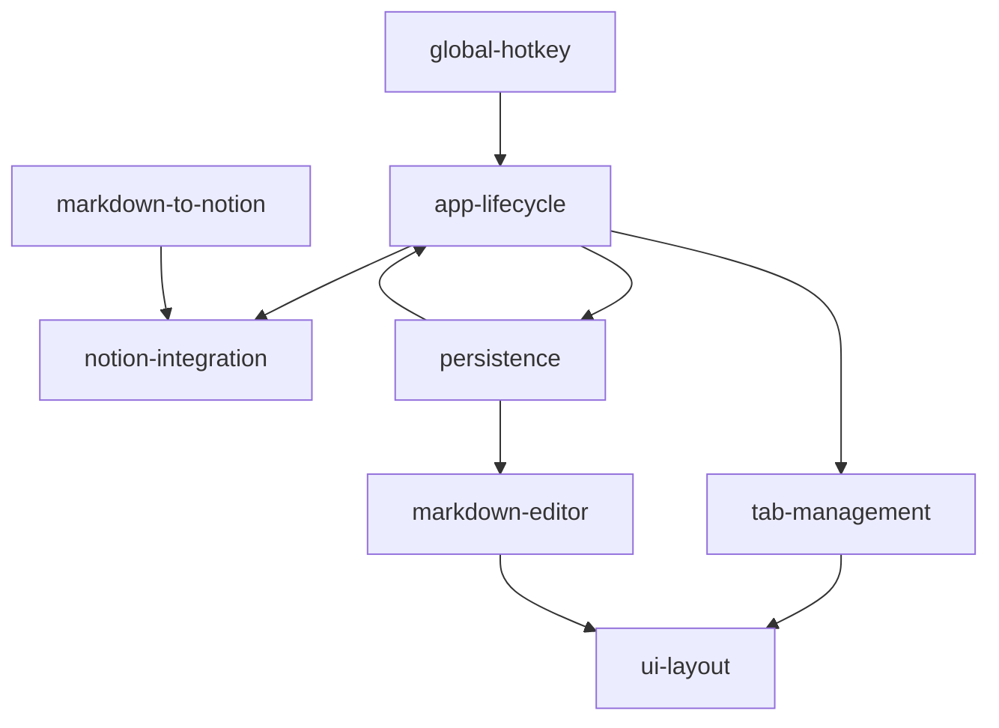

# nTabula タスク一覧 インデックス

**分析日時**: 2026-03-16
**対象**: macOS メモアプリ nTabula (Swift/SwiftUI + Notion API)
**発見タスク数**: 22 タスク (全実装済み)
**推定総工数**: 48h

---

## 機能グループ一覧

| グループ | 概要 | タスク数 | 推定工数 |
|---------|------|---------|---------|
| [app-lifecycle](./app-lifecycle/overview.md) | アプリエントリ・ウィンドウ管理・グローバル状態 | 3 | 6h |
| [tab-management](./tab-management/overview.md) | タブ CRUD・横/縦タブ UI・ピン留め | 4 | 7h |
| [markdown-editor](./markdown-editor/overview.md) | NSTextView・シンタックスHL・IME対応・リスト継続 | 4 | 10h |
| [notion-integration](./notion-integration/overview.md) | Notion REST API・DB/ページ操作 | 5 | 10h |
| [ui-layout](./ui-layout/overview.md) | メインウィンドウ・ステータスバー・設定画面 | 3 | 7h |
| [global-hotkey](./global-hotkey/overview.md) | Carbon Ctrl+Shift+N グローバルホットキー | 1 | 2h |
| [persistence](./persistence/overview.md) | UserDefaults 永続化・自動保存 | 2 | 2h |
| [markdown-to-notion](./markdown-to-notion/overview.md) | Markdown → Notion ブロック変換 | 2 | 4h |

---

## アーキテクチャ依存関係

---

## 実装済み機能サマリー

- ✅ マルチタブエディタ（横/縦レイアウト切り替え）
- ✅ Markdown シンタックスハイライト（H1-H3, 引用, コード, インライン）
- ✅ 日本語 IME 入力対応（マーキング中の破壊防止）
- ✅ リスト継続入力（Return で箇条書き/番号付き/ToDo 自動継続）
- ✅ Notion REST API 統合（DB・子ページ作成/更新）
- ✅ データベース・ページ選択（Settings UI）
- ✅ タイトルプロパティ名の動的解決（多言語ワークスペース対応）
- ✅ グローバルホットキー (Ctrl+Shift+N) ウィンドウトグル
- ✅ Cmd+S で Notion 同期（isDirty チェックで重複防止）
- ✅ 3 秒 debounce 自動保存 (UserDefaults)
- ✅ タブのピン留め機能
- ✅ フォント・サイズ カスタマイズ
- ✅ ウィンドウサイズ・位置の永続化

## 技術的負債・改善推奨事項

| 優先度 | 内容 | 対象ファイル |
|-------|------|------------|
| 高 | Notion API ページネーション未対応 (page_size: 100 固定) | NotionService.swift |
| 中 | ブロック削除→追加の全置換方式（差分更新に変更で API 呼び出し削減） | NotionService.swift |
| 中 | テストコード未実装 | 全ファイル |
| 低 | `derivedTitle` が未使用 (title フィールドに統一済み) | TabItem.swift |
| 低 | SettingsView のフレームサイズがハードコード (500×400) | SettingsView.swift |
