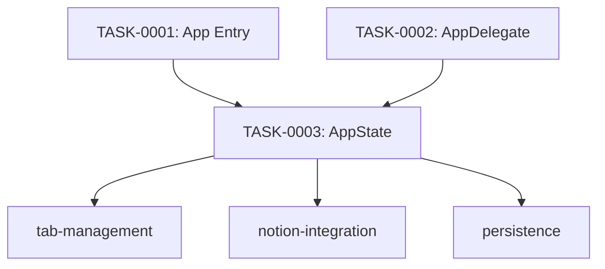

# app-lifecycle タスク一覧

## 概要

**分析日時**: 2026-03-16
**対象コードベース**: Sources/App/
**発見タスク数**: 3
**推定総工数**: 6h

## タスク一覧

#### TASK-0001: アプリエントリポイント・コマンド登録

- [x] **タスク完了** (実装済み)
- **タスクタイプ**: DIRECT
- **実装ファイル**:
  - `Sources/App/nTabulaApp.swift`
- **実装詳細**:
  - `@main` SwiftUI App 定義
  - `AppState` を environment に注入
  - Cmd+T (新規タブ)、Cmd+S (Notion 保存) コマンド登録
  - ウィンドウスタイル: titleBar + unified toolbar (タイトル非表示)
  - デフォルトサイズ: 960×640
- **推定工数**: 1h

#### TASK-0002: ウィンドウ管理・ライフサイクル

- [x] **タスク完了** (実装済み)
- **タスクタイプ**: DIRECT
- **実装ファイル**:
  - `Sources/App/AppDelegate.swift`
- **実装詳細**:
  - NSApplicationDelegateAdaptor として AppDelegate を統合
  - NSWindowDelegate でウィンドウリサイズ・移動時にフレーム保存
  - アプリ終了時にタブ・ActiveTabID を永続化
  - HotKeyService の起動・管理
  - Ctrl+Shift+N でウィンドウ前面/後面トグル
- **推定工数**: 2h

#### TASK-0003: グローバル状態管理 (AppState)

- [x] **タスク完了** (実装済み)
- **タスクタイプ**: DIRECT
- **実装ファイル**:
  - `Sources/App/AppState.swift`
- **実装詳細**:
  - `@Observable @MainActor` で Single Source of Truth を実現
  - タブ CRUD (addNewTab, closeTab, updateContent, updateTitle, togglePin)
  - デフォルトタイトル生成: `yyyy-MM-dd-連番`
  - Notion 同期管理 (syncActiveTab: 変更なし・保存済みはスキップ)
  - 保存先モード: .database / .page 切り替え
  - UI 設定 (tabLayoutMode, autoSaveEnabled, editorFont)
  - 初期化時に PersistenceManager からすべての設定を復元
- **推定工数**: 3h

## 依存関係マップ

