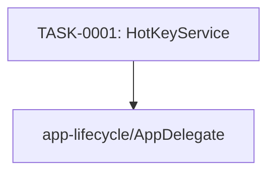

# global-hotkey タスク一覧

## 概要

**分析日時**: 2026-03-16
**対象コードベース**: Sources/Services/HotKeyService.swift
**発見タスク数**: 1
**推定総工数**: 2h

## タスク一覧

#### TASK-0001: グローバルホットキー (Ctrl+Shift+N)

- [x] **タスク完了** (実装済み)
- **タスクタイプ**: DIRECT
- **実装ファイル**:
  - `Sources/Services/HotKeyService.swift`
- **実装詳細**:
  - Carbon `RegisterEventHotKey` で Ctrl+Shift+N をグローバル登録
  - hotKeyID signature: `0x6E546162` ('nTab')
  - `EventHandlerUPP` コールバックで イベント捕捉
  - `onHotKeyPressed` クロージャ: ウィンドウが前面 → 隠す / それ以外 → 前面へ
  - `unregister()` でホットキー解除 (AppDelegate.applicationWillTerminate で呼ぶ)
  - App Sandbox ON 環境での動作 (com.apple.security.network.client のみ必要)
- **推定工数**: 2h

## 依存関係マップ

