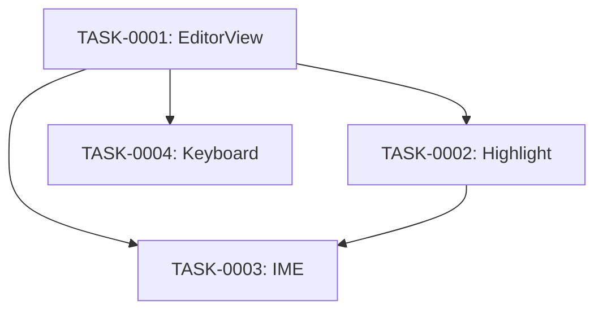

# markdown-editor タスク一覧

## 概要

**分析日時**: 2026-03-16
**対象コードベース**: Sources/Views/EditorView.swift
**発見タスク数**: 4
**推定総工数**: 10h

## タスク一覧

#### TASK-0001: NSTextView ラッパー (EditorView)

- [x] **タスク完了** (実装済み)
- **タスクタイプ**: DIRECT
- **実装ファイル**:
  - `Sources/Views/EditorView.swift`
- **実装詳細**:
  - `NSViewRepresentable` で SwiftUI に統合
  - テキストスタック構築: MarkdownTextStorage → NSLayoutManager → NSTextContainer → NTTextView
  - NSScrollView でラップ、自動スクロール付き
  - 設定: isRichText=false, autoQuote/Dash/Spelling/LinkDetection 無効化
  - textContainerInset: 24px (水平・垂直パディング)
  - `resolvedFont`: editorFontName 設定対応、デフォルト SF Mono
  - タブID変化時のみ `textView.string` 更新（IME保護）
- **推定工数**: 2h

#### TASK-0002: Markdown シンタックスハイライト (MarkdownTextStorage)

- [x] **タスク完了** (実装済み)
- **タスクタイプ**: DIRECT
- **実装ファイル**:
  - `Sources/Views/EditorView.swift` (MarkdownTextStorage クラス)
- **実装詳細**:
  - `NSTextStorage` サブクラス、`processEditing()` でリアルタイムハイライト
  - **ブロックレベル:**
    - H1: フォントサイズ×1.6, bold
    - H2: フォントサイズ×1.35, bold
    - H3: フォントサイズ×1.15, semibold
    - 引用 `> `: 二次ラベルカラー + イタリック
    - 箇条書き `- / * / +`: 先頭マーカーを青色
    - コードフェンス ` ``` `: 緑色
    - 水平線 `--- / *** / ___`: 三次ラベルカラー
  - **インラインレベル** (Regex):
    - `**bold**`: bold フォント
    - `` `code` ``: オレンジ + モノスペース
    - `[link](url)`: 青色
    - `~~strikethrough~~`: 削除線 + 二次色
  - `rehighlight()`: タブ切り替え時に全文ハイライト再適用
- **推定工数**: 3h

#### TASK-0003: 日本語 IME 対応

- [x] **タスク完了** (実装済み)
- **タスクタイプ**: DIRECT
- **実装ファイル**:
  - `Sources/Views/EditorView.swift`
- **実装詳細**:
  - `textDidChange`: `hasMarkedText()` = true なら `updateContent` スキップ
  - `updateNSView`: `currentTabID` が変化した時のみ `textView.string = newContent` を実行
    - 同一タブ内の入力中は View 再評価が textView を上書きしない
  - `processEditing`: `hasMarkedText()` = true なら `applyHighlighting` スキップ
  - `MarkdownTextStorage.textView`: weak var で IME 検出用に保持
- **推定工数**: 2h

#### TASK-0004: キーボードハンドリング・リスト継続

- [x] **タスク完了** (実装済み)
- **タスクタイプ**: DIRECT
- **実装ファイル**:
  - `Sources/Views/EditorView.swift` (NTTextView クラス)
- **実装詳細**:
  - `NTTextView`: NSTextView カスタムサブクラス
  - **Cmd+S**: `NotificationCenter.post(.ntSaveDocument)` → Notion 保存フロー起動
  - **Return キー** (`handleListContinuation`):
    - 箇条書き `- / * / +`: 次の行に同じプレフィックス自動挿入
    - ToDo `- [ ] / - [x] `: 次の行に `- [ ] ` 挿入
    - 番号付きリスト `1. / 2.`: 次の行に `(n+1). ` 挿入
    - 空のリスト行で Return: プレフィックス削除して通常改行
    - Shift+Return: リスト継続なし（通常改行）
- **推定工数**: 3h

## 依存関係マップ


