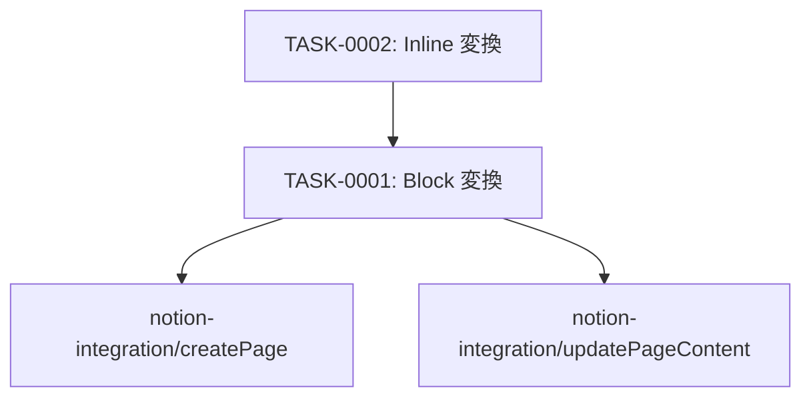

# markdown-to-notion タスク一覧

## 概要

**分析日時**: 2026-03-16
**対象コードベース**: Sources/Utilities/MarkdownToNotion.swift
**発見タスク数**: 2
**推定総工数**: 4h

## タスク一覧

#### TASK-0001: Markdown ブロック変換

- [x] **タスク完了** (実装済み)
- **タスクタイプ**: DIRECT
- **実装ファイル**:
  - `Sources/Utilities/MarkdownToNotion.swift`
- **実装詳細**:
  - 入力: Markdown String / 出力: `[[String: Any]]`（Notion API `children` に直渡し）
  - **見出し:** `# H1` → heading_1, `## H2` → heading_2, `### H3` → heading_3
  - **引用:** `> text` → quote
  - **水平線:** `---`, `***`, `___` → divider
  - **箇条書き:** `- / * / +` → bulleted_list_item
  - **番号付きリスト:** `1. ` → numbered_list_item
  - **ToDo:** `- [ ] ` → to_do (checked: false), `- [x] ` → to_do (checked: true)
  - **コードブロック:** ` ``` ` で囲まれた範囲 → code (言語自動検出)
  - **段落:** その他すべて → paragraph
- **推定工数**: 2h

#### TASK-0002: インライン Rich Text 変換

- [x] **タスク完了** (実装済み)
- **タスクタイプ**: DIRECT
- **実装ファイル**:
  - `Sources/Utilities/MarkdownToNotion.swift`
- **実装詳細**:
  - `parseInline()`: String インデックス走査でマーカーペアをマッチング
  - **bold:** `**text**` / `__text__` → `annotations: { bold: true }`
  - **italic:** `*text*` → `annotations: { italic: true }`
  - **code:** `` `text` `` → `annotations: { code: true }`
  - **strikethrough:** `~~text~~` → `annotations: { strikethrough: true }`
  - **link:** `[text](url)` → `href: url`
  - 未スタイル部分は plain text として flush
  - Notion rich text dict 形式: `{ type: "text", text: { content, link }, annotations }`
- **推定工数**: 2h

## 依存関係マップ


