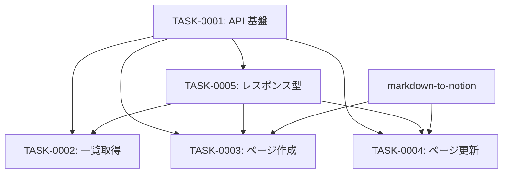

# notion-integration タスク一覧

## 概要

**分析日時**: 2026-03-16
**対象コードベース**: Sources/Services/NotionService.swift, Sources/Models/NotionModels.swift
**発見タスク数**: 5
**推定総工数**: 10h

## タスク一覧

#### TASK-0001: Notion API クライアント基盤

- [x] **タスク完了** (実装済み)
- **タスクタイプ**: DIRECT
- **実装ファイル**:
  - `Sources/Services/NotionService.swift`
- **実装詳細**:
  - `actor` で排他制御
  - 認証: `Authorization: Bearer <token>`, `Notion-Version: 2022-06-28`
  - `makeRequest()`: URL + headers + JSON body を構築
  - `perform<T>()`: データ取得 + ステータスコード検証 + `JSONDecoder` (convertFromSnakeCase) でデコード
  - `NotionAPIError` を throw する統一エラーハンドリング
  - `updateToken()`: トークン変更に対応
- **推定工数**: 2h

#### TASK-0002: データベース・ページ一覧取得

- [x] **タスク完了** (実装済み)
- **タスクタイプ**: DIRECT
- **実装ファイル**:
  - `Sources/Services/NotionService.swift`
  - `Sources/Models/NotionModels.swift`
- **実装詳細**:
  - `fetchDatabases()`: `POST /v1/search` (filter: "database", page_size: 100)
  - `fetchPages()`: `POST /v1/search` (filter: "page", page_size: 100)
  - `NotionDatabase`: `properties` フィールドから `type == "title"` のプロパティ名を自動抽出 (`titlePropertyName`)
  - `NotionPageItem`: `properties` から title タイプの text を `displayTitle` として抽出
  - `NotionListResponse<T>`: hasMore, nextCursor 対応
- **推定工数**: 2h

#### TASK-0003: ページ作成 (DB / 子ページ)

- [x] **タスク完了** (実装済み)
- **タスクタイプ**: DIRECT
- **実装ファイル**:
  - `Sources/Services/NotionService.swift`
- **実装詳細**:
  - `createPage(databaseID, title, titlePropertyName, blocks)`:
    - `POST /v1/pages`
    - `parent: { database_id: ... }`
    - `properties: { [titlePropertyName]: { title: [...] } }`
    - `children: blocks`
  - `createSubPage(pageID, title, blocks)`:
    - `parent: { page_id: ... }`
    - `properties: { title: { title: [...] } }`
    - `children: blocks`
- **推定工数**: 2h

#### TASK-0004: ページ更新 (タイトル + ブロック全置換)

- [x] **タスク完了** (実装済み)
- **タスクタイプ**: DIRECT
- **実装ファイル**:
  - `Sources/Services/NotionService.swift`
- **実装詳細**:
  - `updatePageContent(pageID, title, titlePropertyName, blocks)`:
    1. `PATCH /v1/pages/{id}` でタイトル更新
    2. `GET /v1/blocks/{id}/children` で既存ブロック取得
    3. 全ブロックを `DELETE /v1/blocks/{id}` で削除
    4. `PATCH /v1/blocks/{id}/children` で新規ブロック追加
  - Notion API の仕様上、ブロックの差分更新ではなく全置換
  - `titlePropertyName` で DB / 子ページ のプロパティ名を動的対応
- **推定工数**: 2h

#### TASK-0005: Notion レスポンス型定義

- [x] **タスク完了** (実装済み)
- **タスクタイプ**: DIRECT
- **実装ファイル**:
  - `Sources/Models/NotionModels.swift`
- **実装詳細**:
  - `NotionPage`: id, url, createdTime, lastEditedTime
  - `NotionRichTextItem`: type, plainText (snakeCase 対応)
  - `NotionBlockChildrenResponse`, `NotionBlockResult`: ブロック削除用
  - `NotionAPIError`: Decodable + LocalizedError
  - Swift 6 Sendable 準拠 (`nonisolated init(from decoder:)`)
- **推定工数**: 2h

## 依存関係マップ

