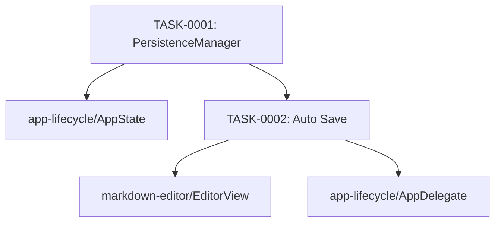

# persistence タスク一覧

## 概要

**分析日時**: 2026-03-16
**対象コードベース**: Sources/Utilities/PersistenceManager.swift
**発見タスク数**: 2
**推定総工数**: 2h

## タスク一覧

#### TASK-0001: UserDefaults ラッパー

- [x] **タスク完了** (実装済み)
- **タスクタイプ**: DIRECT
- **実装ファイル**:
  - `Sources/Utilities/PersistenceManager.swift`
- **実装詳細**:
  - シングルトン `PersistenceManager.shared`
  - Keys enum で全キーを一元管理
  - **タブ**: `[TabItem]` を JSONEncoder/Decoder でシリアライズ
  - **Notion 設定**: token, selectedDatabaseID, selectedParentPageID, notionSaveTarget
  - **UI 設定**: tabLayoutMode (rawValue), autoSaveEnabled (Bool), editorFontSize (Double), editorFontName
  - **ウィンドウ**: frame を NSStringFromRect でシリアライズ
  - **ActiveTabID**: UUID → String 変換
- **推定工数**: 1h

#### TASK-0002: 自動保存トリガー

- [x] **タスク完了** (実装済み)
- **タスクタイプ**: DIRECT
- **実装ファイル**:
  - `Sources/Views/EditorView.swift` (Coordinator)
  - `Sources/App/AppDelegate.swift`
- **実装詳細**:
  - **3 秒 Debounce**: `textDidChange` 後 `DispatchWorkItem` でスケジュール、入力継続時にキャンセル
  - **アプリ終了時**: `applicationWillTerminate` で即時保存
  - **タブ操作時**: addNewTab, closeTab, togglePin, markSaved, updateTitle すべてで saveTabs() を呼ぶ
  - autoSaveEnabled が false の場合は debounce 保存をスキップ
- **推定工数**: 1h

## 依存関係マップ

