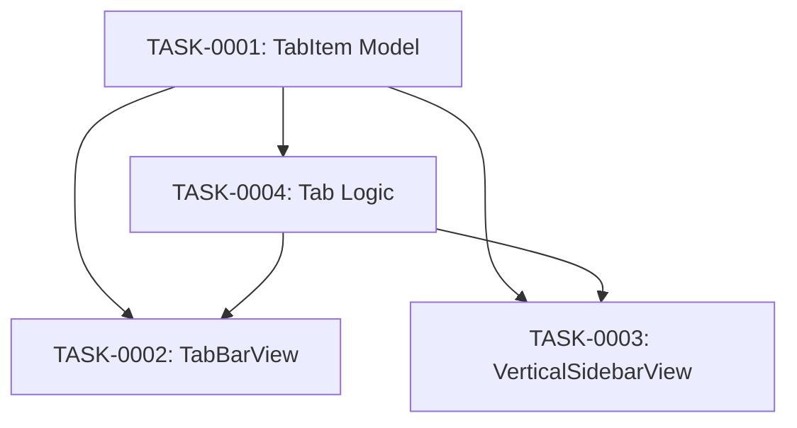

# tab-management タスク一覧

## 概要

**分析日時**: 2026-03-16
**対象コードベース**: Sources/Models/TabItem.swift, Sources/Views/TabBarView.swift, Sources/Views/VerticalSidebarView.swift
**発見タスク数**: 4
**推定総工数**: 7h

## タスク一覧

#### TASK-0001: タブデータモデル

- [x] **タスク完了** (実装済み)
- **タスクタイプ**: DIRECT
- **実装ファイル**:
  - `Sources/Models/TabItem.swift`
- **実装詳細**:
  - Codable + Equatable 構造体
  - フィールド: id, title, content, notionPageID, databaseID, titlePropertyName, isPinned, isDirty, createdAt, updatedAt
  - `derivedTitle`: 本文1行目から自動生成（Notion 以外では未使用）
  - Decoder で isDirty を常に false にリセット（起動時の誤った未保存表示を防止）
  - `titlePropertyName`: Notion DB のタイトルプロパティ名を保持（"Name" / "タイトル" / "title" など）
  - TabLayoutMode enum (horizontal / vertical)
- **推定工数**: 1h

#### TASK-0002: 横タブバー UI

- [x] **タスク完了** (実装済み)
- **タスクタイプ**: DIRECT
- **実装ファイル**:
  - `Sources/Views/TabBarView.swift`
- **実装詳細**:
  - ピン留めタブを固定エリアに表示（Divider 区切り）
  - 通常タブは横スクロール可能
  - "+" ボタンで新規タブ作成
  - TabItemButton: タブタイトル (最大160px), 未保存ドット表示
  - ホバー時に "×" クローズボタン表示
  - Context Menu: ピン留め/解除, タブを閉じる
- **推定工数**: 2h

#### TASK-0003: 縦サイドバー UI (Arc 風)

- [x] **タスク完了** (実装済み)
- **タスクタイプ**: DIRECT
- **実装ファイル**:
  - `Sources/Views/VerticalSidebarView.swift`
- **実装詳細**:
  - ヘッダー: "nTabula" タイトル + "+" 新規タブボタン
  - ピン留めセクション: "固定" ラベル + タブリスト
  - 通常タブ: LazyVStack + ScrollView
  - フッター: DB名 + 同期インジケーター + 設定ボタン
  - SidebarTabRow: アイコン切り替え (pin.fill / doc.text), 未保存ドット, ×ボタン
  - アクティブタブは accentColor で背景ハイライト
  - Context Menu: ピン留め/解除, タブを閉じる
- **推定工数**: 2h

#### TASK-0004: タブ操作ロジック

- [x] **タスク完了** (実装済み)
- **タスクタイプ**: DIRECT
- **実装ファイル**:
  - `Sources/App/AppState.swift`
- **実装詳細**:
  - `addNewTab()`: デフォルトタイトル `yyyy-MM-dd-連番` で生成
  - `closeTab()`: ピン留めタブは閉じ不可, activeTab を隣のタブに移動
  - `togglePin()`: isPinned トグル + 保存
  - `sortedTabs`: ピン留めを先頭にソート済み computed property
  - `updateTitle()`: タイトル変更 + isDirty 設定 + 保存
  - `updateContent()`: コンテンツ変更 + isDirty 設定
- **推定工数**: 2h

## 依存関係マップ

