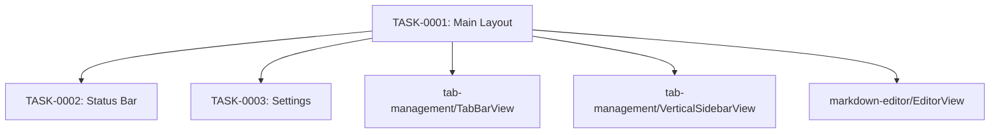

# ui-layout タスク一覧

## 概要

**分析日時**: 2026-03-16
**対象コードベース**: Sources/Views/MainWindowView.swift, Sources/Views/SettingsView.swift
**発見タスク数**: 3
**推定総工数**: 7h

## タスク一覧

#### TASK-0001: メインウィンドウレイアウト

- [x] **タスク完了** (実装済み)
- **タスクタイプ**: DIRECT
- **実装ファイル**:
  - `Sources/Views/MainWindowView.swift`
- **実装詳細**:
  - **横レイアウト**: TabBarView → titleField → EditorView → statusBar
  - **縦レイアウト**: VerticalSidebarView | (titleField → EditorView → statusBar)
  - `tabLayoutMode` で動的切り替え (アニメーション付き)
  - `titleField`: TextField でタブタイトル編集 (18pt, semibold)、AppState.updateTitle に連携
  - Cmd+S イベント: NotificationCenter subscribe → syncActiveTab()
  - ツールバー: レイアウト切り替えボタン + Notion 保存ボタン
  - minWidth: 650, minHeight: 400
- **推定工数**: 2h

#### TASK-0002: ステータスバー

- [x] **タスク完了** (実装済み)
- **タスクタイプ**: DIRECT
- **実装ファイル**:
  - `Sources/Views/MainWindowView.swift`
- **実装詳細**:
  - **DB セレクターメニュー**: 接続済み (緑ドット + DB名), 未接続 → 設定を開く
  - **同期ステータス**: ProgressView (同期中) / 未保存ドット+オレンジ文字 / "保存済み" (グレー)
  - **エラー表示**: 赤色テキスト + `.help()` でフルメッセージ
  - `.bar` 背景 + 上辺に Divider
- **推定工数**: 1h

#### TASK-0003: 設定ウィンドウ

- [x] **タスク完了** (実装済み)
- **タスクタイプ**: DIRECT
- **実装ファイル**:
  - `Sources/Views/SettingsView.swift`
- **実装詳細**:
  - **一般タブ:**
    - フォント選択 Picker (SF Mono + システムのモノスペースフォント一覧)
    - フォントサイズスライダー (10～28pt)
    - タブレイアウト選択 (segmented: 横タブ / 縦タブ)
    - 自動保存トグル
  - **Notion タブ:**
    - SecureField で Integration Token 入力
    - "保存して接続" ボタン → token 保存 + fetchDatabases()
    - 保存先タイプ: segmented (データベース / ページ（子ページ）)
    - データベース選択 Picker (未選択 + DB一覧) + 再読み込みボタン
    - 親ページ選択 Picker + 再読み込みボタン
    - ローディング ProgressView
    - エラーメッセージ表示
  - `SettingsLink {}` で設定ウィンドウを開く（推奨 API 使用）
  - フレーム: 500×400
- **推定工数**: 4h

## 依存関係マップ

